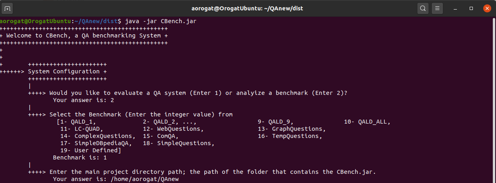

# CBench: Benchmark Analysis Mode
This document shows you how to configure CBench to analyze a benchmark and what you expect from CBench.
* __Run CBench.jar__ Using the command ``` java -jar "PATH/TO/projectFolder/CBench.jar" ```, run the project or change the current directory in the terminal to the directory where CBench located and run this command ``` java -jar CBench.jar ```.
* __Configure CBench__ This is the first step after running CBench. You have to configure the system as shown

* The System then preprocess the questions and print all of them as in the figure below

* The System then print some statistics as shown. QALD-1 has 100 questions, just 3 of them are shown.

* In the end, the system prints the queries (if any) analysis and the NLQ analysis.


