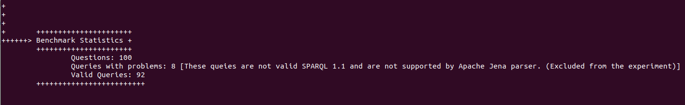

# CBench: Benchmark Analysis Mode
This document shows to you how to configure CBench to analyze a benchmark and what is expected from CBench.
* __Run CBench.jar__ Using the command ``` java -jar "PATH/TO/projectFolder/CBench.jar" ```, run the project. or change the current directory in the terminl to the directory wwhere CBench is locted and run this command ``` java -jar CBench.jar ```.
* __Configure CBench__ This is the first step after running CBench. You have to configure the syste as shown

* The System then preprocess the questions and print all of them as in the figure below

* The System then print some statistics as shown

* At the end the system prints the queries (if any) analysis and the NLQ analysis.


