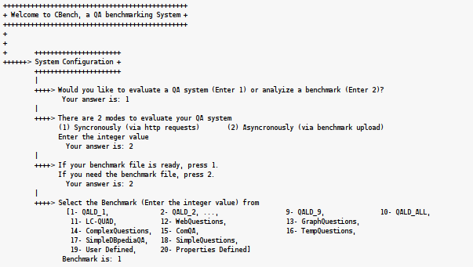
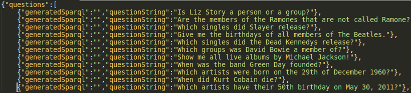
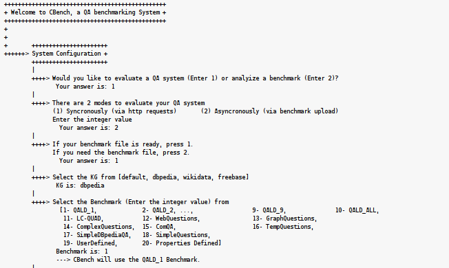

[<< Home](https://github.com/aorogat/CBench/)
# [Video](https://www.youtube.com/watch?v=JCy023Tdh4I&list=PLCFktcVimvewPhVBa2KyAnAK57rCKXXcs&index=3)


# QA Offline Evaluation by a benchmark file
You can use this mode if your QA  system does not support HTTP requests. In this mode,  CBench outputs a file that includes the questions from the benchmark selected by you with empty fields corresponding to the your generated queries for each question.Your QA system must update this file with the generated queries. Then CBench can calculate the quality scores and generate the interactive evaluation report for you.

Here are the steps to use this mode
* Ask CBench for the required benchmark file. The step sare shown in the image.



CBench generated a file called `Generated_Benchmark.json` in the root directory of the project.

* Fill the empty answers fields by your QA system

Now, CBench generated a file like this



As you can see, the `answer` fields are empty. Please fill them with you generated answers for each question. CBench use such answers to compute your QA scores.

* Return the updated files to CBench to calculate the scores

Please return the file to the same place with the name ```QA.json``` (the main directory) then run CBench as follow



Note: you must select the same benchmark you selcted for the generated file.
