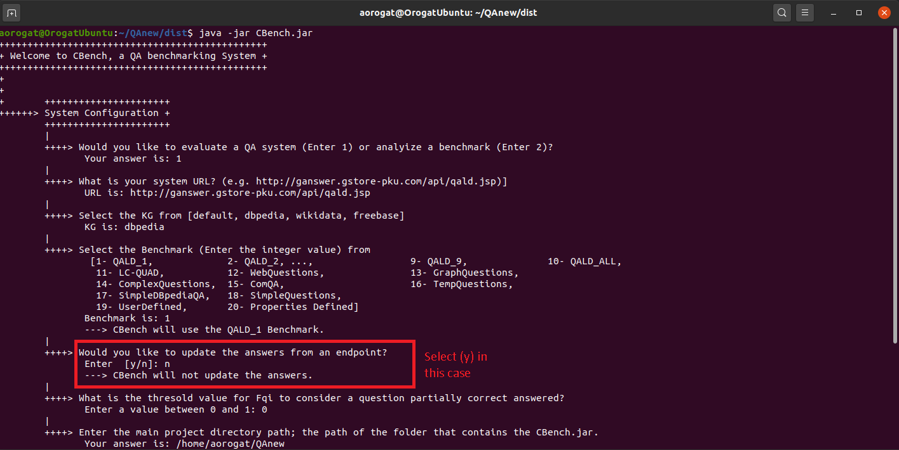

[<< Home](https://github.com/aorogat/CBench/)

If the users of CBench would like to evaluate a QA system on a benchmark file that does not have the answers or the answers need to be updated, they have to select to update the answers when CBench asks them as shown.

After that, CBench will ask about the knowledge graph URL that it will communicate to run the SPARQL queries to get the golden answers. If the users would like to use DBpedia or Wikidata, they can use the available endpoints (e.g. https://dbpedia.org/sparql? or https://query.wikidata.org/ respectively). If they would like to use them with a specific version of the KG or __use another KG__, it is their responsibility to download the KG and host it on the Virtuoso system. To set up your KG on Virtuoso, please follow [Virtuoso documentation](http://vos.openlinksw.com/owiki/wiki/VOS). Once your KG is ready, provide CBench with the endpoint URL.
