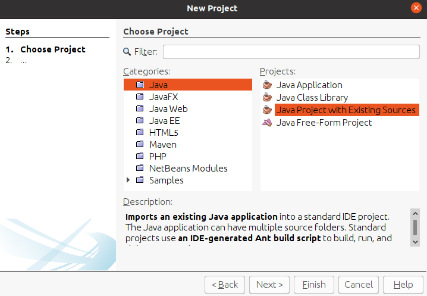

[<< Home](https://github.com/aelroby/CBench/)

### Edit CBench in Netbeans
* Download the *src* folder which contains the java source code.
* Using Netbeans, create a new Java Project with Existing Sources as in the image and add the folders inside it to your project in the next step.

* Download the Python files (.py files) in home directory of your project. The Java code runs such files.
* Download the *.jar* files from the *lib* folder and add all of them as liberaries to your project.
* Download the *data* folder, unzip the files inside it and add it to your project. The project structure must be as follow
```
projectFolder  
│
|─── data
│   |─── userDefinied.json
│   |─── DBpedia
│   |   │─── No_SPARQL
│   |   └─── SPARQL
|   |
│   └─── Freebase
│       │─── No_SPARQL
│       └─── SPARQL
│   
|─── src
|   └─── ... All packages
│
└─── lib
|   └─── ... All .jar files
│   
└─── evaluate.py

```

Now you can edit and run the project.
